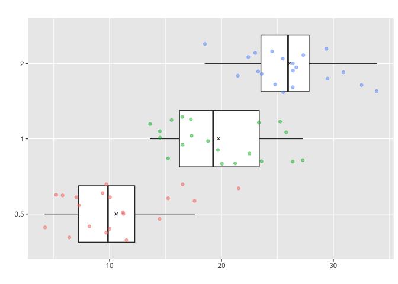

<!-- README.md is generated from README.Rmd. Please edit that file -->

# Jitterbox

<!-- badges: start -->
<!-- badges: end -->

This is a package created by Brynley Hanson-Wright for the course STAT
545B taught by Vincenzo Coia in 2021. The goal of this package is to
allow you to make quick plots that compare the distribution of a numeric
variable within groups of a categorical variable. It displays boxplots,
stripplots, and means within each group to visualize both raw data and
summary statistics.

## Installation

Jitterbox is not on CRAN. You can download the package from this
repository with:

``` r
#install.packages("devtools")
#devtools::install_github("brynhw/Jitterbox") 
```

## Examples

One simple example is looking at Edgar Anderson’s Iris dataset and
plotting the distribution of sepal length for each species.

``` r
library(Jitterbox)
box.bygroup(iris, Sepal.Length, Species, numeric.lab = "Sepal length", group.lab = "Iris species")
```


Another example with the ToothGrowth dataset shows how the function can
use non-factor inputs for the grouping variable. In this case dose is
numeric, but given there are three levels of dose it makes sense to
treat these as categorical levels. The function will do this and return
a warning in case a non-factor variable was mistakenly entered.

``` r
box.bygroup(ToothGrowth, len, dose)  
#> Warning in box.bygroup(ToothGrowth, len, dose): The group.var you have entered is not a factor. You have entered an object of class numeric and it has been converted into a factor. Check to make sure this was the grouping variable you intended to specify.
#>             You can use as.factor() in the group.var argument to avoid this warning.
```



Lastly, here is an example using life expectancy data by continent from
the Gapminder dataset. Because there is quite a bit more data in this
plot, the alpha level of the points can be adjusted with the point.alpha
argument.

``` r
box.bygroup(gapminder::gapminder, lifeExp, continent, point.alpha = 0.3)  
```


